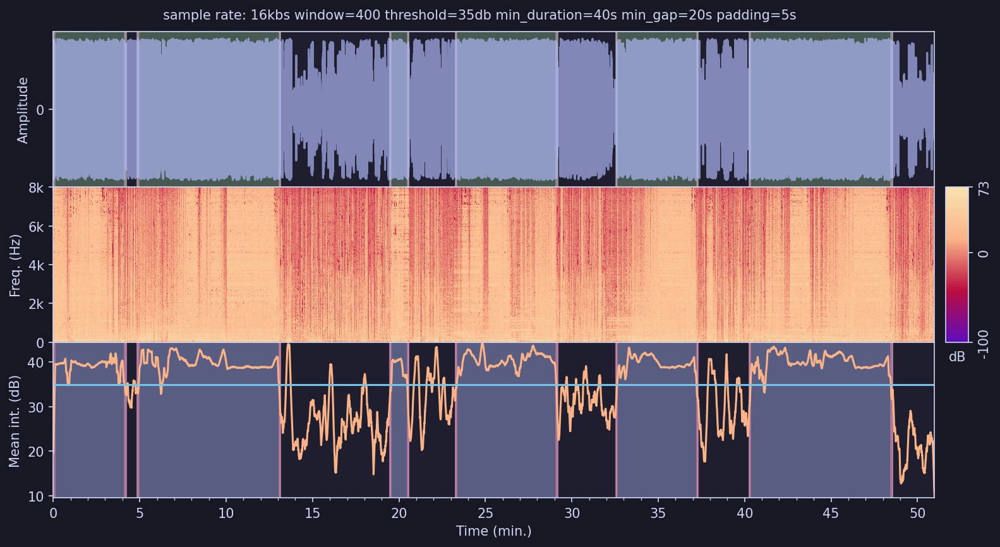

# Song Hog
Song hog snuffles through recordings to find the bits that matter.
An algorithm to identify and chop songs out from long recordings. Designed to help with extracting and reviewing demos from long recordings of band rehearsals.
The API harness is fairly specifically tailored to my use-case with Ggl recordings, but it could easily be adapted or just run locally.



## How it works
- Convert audio file to a mono 16bit wave and extract the amplitude data.
    - The quality doesn't matter too much as we chop up the original anyway
- Create a spectrogram via a fourier transform, sampling a sensible window
- Get the mean intensities as function of time
- Smooth out the line to your taste
- Find segments of audio above a particular threshold, over a particular amount of time
- Merge segemnets that are really close together
- Chop up the original recording
- Create a "queue job" file with recording paths
    - to be picked up by another service and uploaded elsewhere

## Parameters
The parameters that ultimately affect how the algorithm identifies the segments in a given recording. The default values I settled on are:
```
    window: int = 400
    threshold: float = 35
    min_duration: float = 40
    min_gap: float = 20
    padding: float = 5
```
These are what suit the quality and type of recording that I tend to use with the tool. For a deeper investigation and comparison of how changing these parameters affects the results take a look at my blog (when it's ready!).

- **Window**
The degree of smoothing applied to the mean intensity plot with `numpy.convolve` - a larger number results in greater smoothing, as each value is blurred with more neighbouring values. The default value I settled on was 400. A window value of 1 will result in no smoothing. In practice some smoothing is sensible as the raw data can be very choppy which can make it a bit trickier to accurately identify consistency in regions of data.

- **Threshold**
Simply the 'mean intensity' which is ~ average volume from the spectrogram. In the algortihm it determines the minimum intensity above which 'live music' is detected. On the plots above it is the horizontal line on the mean intensity plot. I found 35 works well enough with my phone and style of recordings. Again, see the blog for detailed comparison plots.

- **Minimum duration**
Fairly self explanatory - minimum duration that the mean intensity is above the threshold for to be considered a discrete segment of music. I have gone with 40 seconds to avoid picking up random guitar thrashing between songs.

- **Min gap**
Minimum time required between detected segments for them not to be merged. For example, if 2 segments were detected with the first segment ending 19 seconds before the second begins - a minimum gap of 20s would result in these being merged into a single segment.

- **Padding**
Time added to the start and end of a detected segment. Applied before merging. Just gives a bit of leeway when detecting segments.

## Running Locally

Copy the following into a `.env` file at the project root and fill in the values:

```env
# Required: API authentication key (any string you choose)
SONG_HOG_API_KEY=your-secret-key

# Optional: override default storage locations
MEDIA_DIR=media
QUEUE_DIR=queue

# Optional: logging
LOG_LEVEL=INFO
LOG_FILE=                        # leave blank to log to stdout only
```

Start the API in development mode:

```bash
uvicorn api:app --reload
```

## Downloader Configuration

By default the API downloads from [Google Recorder](https://recorder.google.com). To target a different service, set the `DOWNLOADER_*` environment variables — no code changes required.

If `DOWNLOADER_INPUT_URL_BASE` is set, all other required variables must also be provided or the API will refuse to start.

| Variable | Description | Required |
|---|---|---|
| `DOWNLOADER_INPUT_URL_BASE` | Base URL of the recording service shown to users (e.g. `https://recorder.google.com/`) | Yes — activates custom config |
| `DOWNLOADER_EXPECTED_HOST` | Hostname allowlist for input URLs (e.g. `recorder.google.com`) | Yes |
| `DOWNLOADER_SCHEME` | Allowed URL scheme (e.g. `https`) | Yes |
| `DOWNLOADER_DOWNLOAD_URL_BASE` | Base URL used to construct the actual download request | Yes |
| `DOWNLOADER_FILE_ID_RE` | Regex allowlist for extracted file IDs (e.g. `^[a-zA-Z0-9\-]+$`) | Yes |
| `DOWNLOADER_DOWNLOAD_URL_RE` | Regex the fully constructed download URL must match | Yes |
| `DOWNLOADER_MAX_URL_LENGTH` | Maximum accepted input URL length | No (default: `2048`) |

Example for a hypothetical alternative service:

```env
DOWNLOADER_INPUT_URL_BASE=https://myservice.com/recordings/
DOWNLOADER_EXPECTED_HOST=myservice.com
DOWNLOADER_SCHEME=https
DOWNLOADER_DOWNLOAD_URL_BASE=https://api.myservice.com/download/
DOWNLOADER_FILE_ID_RE=^[a-zA-Z0-9\-]+$
DOWNLOADER_DOWNLOAD_URL_RE=^https://api\.myservice\.com/download/[a-zA-Z0-9\-]+$
```

## Unit Tests
```bash
# Run all tests
.venv/Scripts/python -m unittest discover -s tests -v

# Run tests from a single file
.venv/Scripts/python -m unittest tests.test_validation -v

# Run a single test case
.venv/Scripts/python -m unittest tests.test_validation.TestExtractFileId.test_extracts_id
```

## API Test Client

`api_test.py` is a CLI tool for hitting the API endpoints from the terminal. It loads credentials from `.env` by default. Just a nice way of manually checking everything is working locally without crafting curl commands.

```bash
# Health check (no auth)
.venv/Scripts/python api_test.py health

# Process by Google Recorder URL
.venv/Scripts/python api_test.py url --url "https://recorder.google.com/share/..."

# Process by Google Recorder file ID
.venv/Scripts/python api_test.py id --id "abc456"

# Upload a local .m4a file
.venv/Scripts/python api_test.py upload --file media/session.m4a
```

### Global flags

| Flag | Description | Default |
|------|-------------|---------|
| `--api-key` | Override the API key | `SONG_HOG_API_KEY` from `.env` |
| `--host` | Override the base URL | `http://localhost:8000` |

```bash
# Custom key or host (flags go before the subcommand)
.venv/Scripts/python api_test.py --api-key mykey123 id --id "abc456"
.venv/Scripts/python api_test.py --host http://myserver:8000 upload --file media/session.m4a
```
